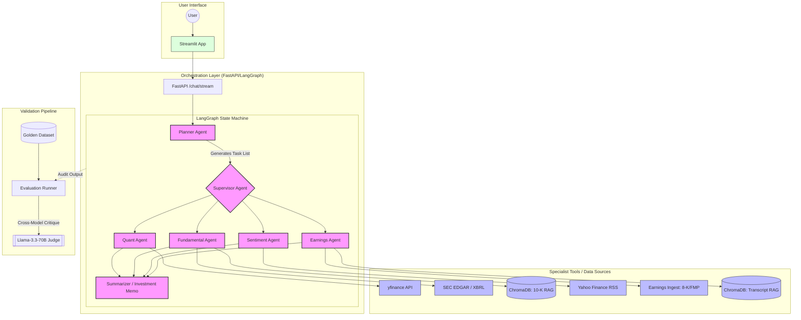

# 🏗️ FinAgent System Architecture

This diagram visualizes the flow of data and control through the multi-agent system.

---

### Component Breakdown

1.  **The Planner (LLM)**: Deconstructs raw natural language into a structured JSON task plan.
2.  **The Supervisor (Python)**: Decouples the LLM from routing logic to ensure deterministic execution and prevent "agent infinite loops."
3.  **Worker Agents (ReAct)**: Specialized nodes with specific tool-access:
    *   **Quant**: Financial metrics and time-series data.
    *   **Fundamental**: RAG over 10-K filings + XBRL tag extraction.
    *   **Sentiment**: Real-time RSS news analysis.
    *   **Earnings**: Q&A vs. Prepared Remarks divergence analysis.
4.  **ChromaDB**: Local vector store providing context for RAG operations.
5.  **Validation Pipeline**: An independent audit layer that measures agent precision against "Anchored Ground Truth."
